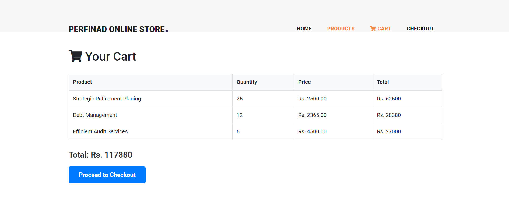
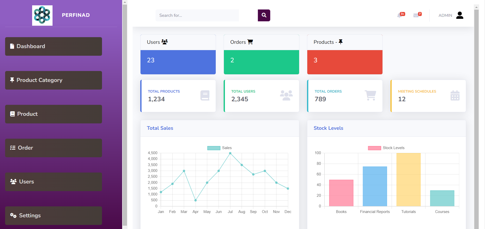

PERFINAD is a sophisticated CRM platform specifically designed for the financial advisory sector. Built using the Laravel framework, PERFINAD serves as an all-encompassing solution that bridges the gap between financial advisors and their clients. In addition to facilitating advisory services, it features a dedicated marketplace for books and an intuitive admin dashboard for effective platform management.

## Screenshots
## About PERFINAD
<p align="center"><a href="https://laravel.com" target="_blank"></a></p>
<p>Home Page </p>

<p align="center"><a href="https://laravel.com" target="_blank"></a></p>
<p>About Us Page </p>

<p align="center"><a href="https://laravel.com" target="_blank"></a></p>
<p>Services Page </p>

<p align="center"><a href="https://laravel.com" target="_blank"></a></p>
<p>Services Page </p>

<p align="center"><a href="https://laravel.com" target="_blank"></a></p>
<p>Shop Page </p>

<p align="center"><a href="https://laravel.com" target="_blank"></a></p>
<p>Shop Page </p>

<p align="center"><a href="https://laravel.com" target="_blank"></a></p>
<p>Cart  </p>

<p align="center"><a href="https://laravel.com" target="_blank"></a></p>
<p>Addmin Dashboard  </p>

## Features

### Financial Advisory System
- **Client-Advisory Interaction**: Streamlines communication between advisors and clients.
- **Advisory Management**: Facilitates efficient handling of advisory services and client portfolios.

### Marketplace for Books
- **Explore and Purchase**: Users can browse and buy a variety of books.
- **Collection Management**: Allows users to manage their book collections seamlessly.

### Admin Dashboard
- **User Management**: Comprehensive control over user accounts and roles.
- **Product Management**: Easy administration of products and product categories.
- **Category Management**: Organize and manage product categories for better user experience.

## Technology Stack
- **Framework**: Laravel
- **Frontend**: Blade Templates, HTML, CSS, JavaScript
- **Database**: MySQL
- **Other Tools**: Composer, Artisan

## Installation

1. Clone the repository:
   ```sh
   git clone https://github.com/yourusername/perfinad.git
2.Install dependencies:
 composer install && npm install <br>
3. Configure environment variables: Copy .env.example to .env and update with your configuration. <br>
4.Run migrations: php artisan migrate<br>
5.Start the development server: php artisan serve<br>
